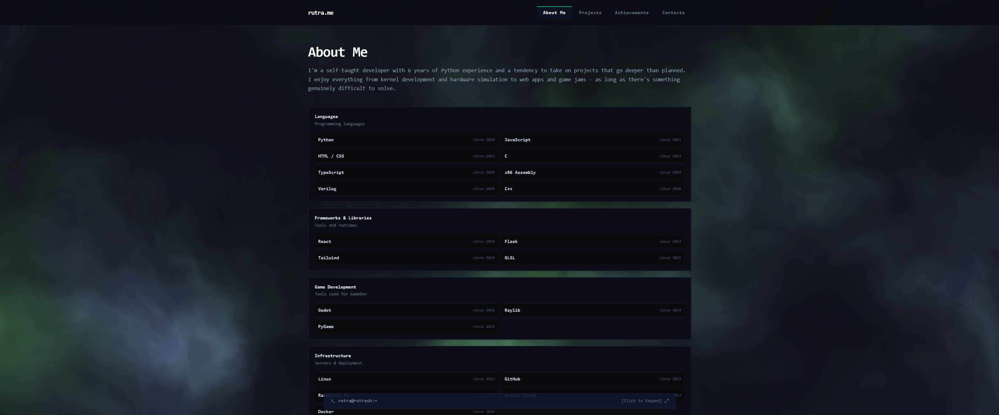
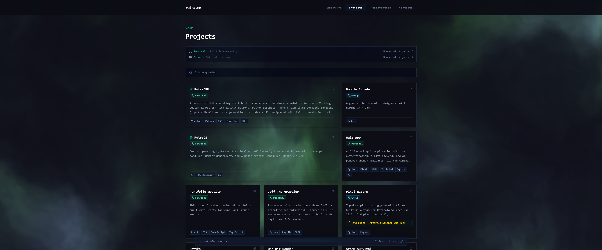

# Portfolio Website

A modern, animated personal portfolio built with React, TypeScript, Tailwind CSS, and Framer Motion.

Live: [rutra.me](https://rutra.me)

## What's in it

- **About** - Skills and tools by category
- **Projects** - Browse projects with live demos and source code
- **Achievements** - Competition results and awards
- **Contact** - Links to email, LinkedIn, GitHub
- **Terminal** - A terminal-like interface to navigate the portfolio

## Screenshots


## Tech Stack

- [React](https://react.dev/)
- [TypeScript](https://www.typescriptlang.org/)
- [Tailwind CSS](https://tailwindcss.com/)
- [Framer Motion](https://www.framer.com/motion/)

## Getting Started

```bash
npm install
npm run dev
```
